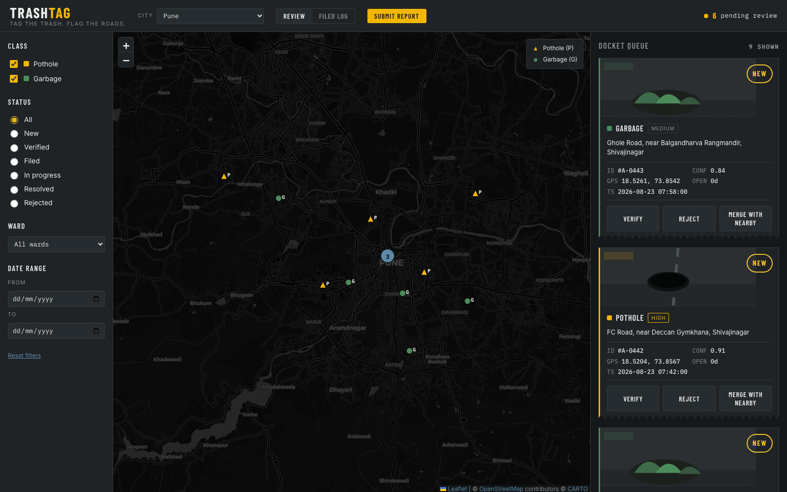

<div align="center">

# 🗑️ TrashTag

### _Tag the trash. Flag the roads._

**Turn citizen photos of potholes and garbage dumps into deduplicated, filed civic complaints — with AI detection, geospatial clustering, and a human always in the loop.**

[](https://github.com/adarshbattu109/trashtag/actions/workflows/ci.yml)
[](https://www.python.org/downloads/)
[](LICENSE)
[](https://github.com/astral-sh/ruff)
[](#development)



</div>

---

## What is TrashTag?

Potholes and garbage dumps get reported to municipal bodies through fragile, city-by-city apps — or not at all. TrashTag is a platform that collects evidence from **many citizen sources** (phone uploads, dashcams, drones), runs **AI detection**, **deduplicates issues geospatially**, and helps get real ones **filed with the responsible authority** — with a person confirming every submission.

It ships as one FastAPI service that:

- serves an **ops-review dashboard** for inspectors,
- exposes a **REST API** and an **MCP server** over the same data (so an LLM agent can query issues too),
- runs a **pluggable detection pipeline** you can point at a stub, a local vision model, or a cloud VLM.

> **Naming:** "TrashTag" covers both garbage *and* potholes — the tagline carries the road-hazard half of the scope. Keep them paired in public-facing material.

---

## Highlights

| | |
|---|---|
| 🎫 **Docket-card dashboard** | A distinctive "night-patrol" inspection UI — every detection is a stamped, tear-off docket with evidence, GPS, and one-motion Verify / Reject / Merge. |
| 🗺️ **Live map** | Leaflet + OpenStreetMap (dark), class-colored markers, zoom clustering, click-to-highlight. |
| 📸 **Citizen capture** | In-browser Submit flow: device **geolocation**, **camera** capture, or photo upload with **EXIF-GPS** auto-extraction → posts to the ingestion API. |
| 🧠 **Pluggable detection** | A `Detector` seam with a deterministic **stub** (default), or a **free local/cloud VLM** (Ollama, vLLM, HF router, DashScope…) — validated live with **Qwen3-VL**. |
| 📍 **Geospatial dedup** | New detections within ~15 m of an open same-class issue merge as evidence, not duplicates (haversine; PostGIS-ready). |
| 🎞️ **Video anti-spam** | Perceptual-hash frame gate collapses a burst of near-identical frames into **one** detector call (98%+ fewer calls in testing). |
| 🔌 **MCP-native** | Every endpoint is auto-exposed as a Model Context Protocol tool at `/mcp`. |
| 🧪 **Real engineering** | 44 tests, Ruff lint+format, `pip-audit`, Dependabot, conventional-commit CI, auto-versioning & release workflows. |

---

## Quickstart

Requires [uv](https://docs.astral.sh/uv/) and Python 3.14+.

```bash
git clone https://github.com/adarshbattu109/trashtag.git
cd trashtag
uv sync
uv run trashtag          # serves http://127.0.0.1:8000
```

- **Dashboard** → <http://127.0.0.1:8000>
- **API docs (Swagger)** → <http://127.0.0.1:8000/docs>
- **MCP** → <http://127.0.0.1:8000/mcp>

---

## How it works

```
Citizen sources ─▶ Ingestion API ─▶ Processing (detect) ─▶ Geo-dedup ─▶ Ops Dashboard
  photo + GPS       POST /v1/reports    stub | VLM | YOLO     ~15m merge      review & file
                    (idempotent,         + confidence gate    → issues        (human in loop)
                     media store,        + frame-dedup        + lifecycle
                     queue)              (video anti-spam)
```

The pipeline is split into isolated, independently-tested stages behind a small shared seam
(`models`, `geo`, `store`, `db`, a `Detector` protocol):

| Stage | Module | What it does |
|---|---|---|
| **§2.1 Ingestion** | `pipeline/ingest.py` | `POST /v1/reports` — media to a filesystem store, idempotency by content-hash + location, enqueue. |
| **§2.2 Processing** | `pipeline/process.py`, `detector.py`, `vlm.py` | Dequeue → run the detector → confidence gate → persist `raw_detections`. |
| **§2.3 Geo-dedup** | `pipeline/dedup.py` | Cluster detections within ~15 m of an open same-class issue; roll up evidence and lifecycle. |
| **Video gate** | `pipeline/frames.py` | Perceptual-hash frame selection so near-identical frames never reach the detector. |

> **Prototype fidelity:** this is a runnable, fully-tested **zero-infra slice** — SQLite (with a
> haversine distance) stands in for PostgreSQL/PostGIS, the filesystem for S3/MinIO, and a stub
> detector for a fine-tuned model. Every seam is designed to swap in the production component
> (PostGIS, object storage, YOLO/VLM) without touching the stages. See the [architecture plan](docs/civic-vision-architecture-plan.md).

---

## API

| Method | Path | Description |
|---|---|---|
| `GET` | `/` | The ops dashboard (single-page UI) |
| `GET` | `/health` | Liveness check |
| `POST` | `/v1/reports` | Submit a report (multipart: `media`, `lat`, `lng`, …) → `202 queued` / `200 duplicate` |
| `GET` | `/v1/issues` | List issues; filter `?class=pothole\|garbage` and `?status=…` |
| `GET` | `/v1/issues/{id}` | One issue by detection ID |
| — | `/mcp` | The same operations as MCP tools |
| `GET` | `/docs` | OpenAPI / Swagger UI |

---

## Detection

Detection is selected with `TRASHTAG_DETECTOR`:

### `stub` (default)
Deterministic, hash-based, no model or network. Ideal for development, tests, and demos.

### `vlm` — free local or cloud vision model
Any OpenAI-compatible vision endpoint works **unchanged** — the detector speaks base64 `image_url` chat and expects strict JSON.

```bash
# Free & local (recommended) — needs Ollama 0.12.7+
ollama serve && ollama pull qwen3-vl:2b
TRASHTAG_DETECTOR=vlm TRASHTAG_VLM_MODEL=qwen3-vl:2b uv run trashtag
```

It's been validated live against **Qwen3-VL** (see [`docs/research/qwen2.5-vl-detector.md`](docs/research/qwen2.5-vl-detector.md)) — it correctly returned `pothole 0.95` / `garbage 0.92` on real photos. For cloud, point `TRASHTAG_VLM_*` at the HF Inference router, DashScope, OpenRouter, or a self-hosted vLLM server. The detector uses `temperature=0`, tolerates markdown-fenced JSON, and degrades gracefully (a report it can't classify simply yields no detections).

> Real fine-tuned **YOLO** weights swap in behind the same `Detector` protocol — a ~40-line `YOLODetector`, no pipeline changes.

---

## Configuration

All configuration is environment variables.

| Variable | Default | Purpose |
|---|---|---|
| `TRASHTAG_HOST` / `TRASHTAG_PORT` | `127.0.0.1` / `8000` | Server bind address |
| `TRASHTAG_ENV` | `dev` | `dev` enables auto-reload |
| `TRASHTAG_DATA_DIR` / `TRASHTAG_DB` | `data/` / `data/trashtag.db` | Media store + SQLite path |
| `TRASHTAG_DETECTOR` | `stub` | `stub` or `vlm` |
| `TRASHTAG_VLM_HOST/PORT/PATH/MODEL` | `localhost` / `11434` / `/v1` / `llama3.2-vision` | VLM endpoint |
| `TRASHTAG_VLM_API_KEY` | `""` | Bearer token for cloud VLM endpoints |
| `TRASHTAG_VLM_TIMEOUT` | `90` | VLM request timeout (seconds) |
| `TRASHTAG_FRAME_THRESHOLD` | `10` | Hamming distance (of 64) below which two frames are the "same scene" |

---

## Project structure

```
src/trashtag/
├── constants/     names, issue classes/statuses, OS-agnostic paths
├── helper/        runtime config + canonical mock issue data
├── app/           FastAPI service (serve.py), uvicorn runner, static/dashboard.html
└── pipeline/      models · geo · store · db · interfaces  (shared seam)
                   ingest · detector · vlm · process · dedup · frames  (stages)
tests/             44 tests — API, filters, dedup, detector, frames, e2e
docs/              architecture plan · dashboard spec · research notes
.github/           CI, publish, version-bump, pr-title, dependabot, templates
```

---

## Development

```bash
uv run pytest                 # 44 tests, no network
uv tool run ruff check .      # lint
uv tool run ruff format .     # format
uv build                      # build sdist + wheel
```

CI runs lint, tests, and a `pip-audit` of the locked dependency set on every push and PR. PR
titles follow [Conventional Commits](https://www.conventionalcommits.org/) and drive automatic
version bumps. See [CONTRIBUTING.md](CONTRIBUTING.md).

---

## Roadmap

TrashTag is built in phases. What's in this repo today is a working slice of Phase 1 plus parts of Phase 2.

- [x] Ops-review dashboard (docket cards, live map, filters, filed log)
- [x] Ingestion API + idempotency + queue (§2.1)
- [x] Processing pipeline + pluggable detector + confidence gate (§2.2)
- [x] Geospatial dedup + issue lifecycle (§2.3)
- [x] Citizen capture (geolocation / camera / EXIF), MCP server
- [x] Video frame-dedup (anti-spam)
- [ ] Wire the dashboard & `/v1/issues` to live pipeline data (retire mock)
- [ ] Background processing worker
- [ ] Filing adapters — CPGRAMS (national default) + ICMC (Bengaluru); human presses send (§2.4)
- [ ] Fine-tuned YOLO detector + on-device pre-filter
- [ ] Public map with face/plate blurring; PostGIS + object storage in production

Filing-adapter research: [CPGRAMS/architecture §2.4](docs/civic-vision-architecture-plan.md) · [I Change My City](docs/research/ichangemycity-filing-adapter.md).

---

## Design principles

- **Human always presses send.** No adapter auto-files a complaint to an authority.
- **Never guess an authority.** If a location can't be matched to a jurisdiction, it's marked "outside coverage," not misrouted.
- **Probable, not asserted.** Contractor/tender matches are always worded as _"probable match, verify against tender documents."_
- **Privacy is a hard gate.** Face/licence-plate blurring is required before any image reaches a public surface.

---

## Documentation

- 📐 [Architecture & build plan](docs/civic-vision-architecture-plan.md)
- 🎨 [Dashboard design spec](docs/civic-vision-dashboard-design-spec.md)
- 🔬 [Research: Qwen2.5/3-VL detector](docs/research/qwen2.5-vl-detector.md) · [Research: I Change My City adapter](docs/research/ichangemycity-filing-adapter.md)
- 🔒 [Security policy](SECURITY.md) · 🤝 [Contributing](CONTRIBUTING.md) · 📜 [Code of Conduct](CODE_OF_CONDUCT.md)

---

## Attribution

Several design decisions — jurisdiction-aware "outside coverage" routing, "probable match" contractor wording, distance-based deduplication, and the human-always-presses-send rule — are adopted from [coding-parrot/pothole-reporter](https://github.com/coding-parrot/pothole-reporter) by Gaurav Sen (MIT). See architecture plan §5.

## License

[Apache License 2.0](LICENSE) © Adarsh Battu
